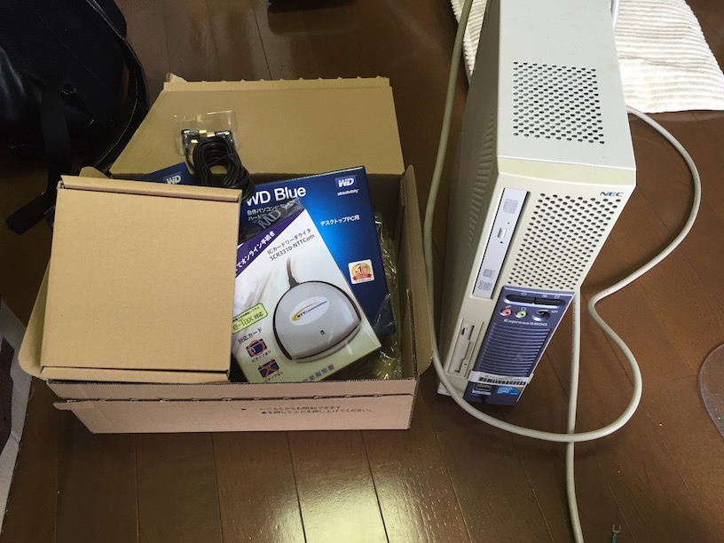
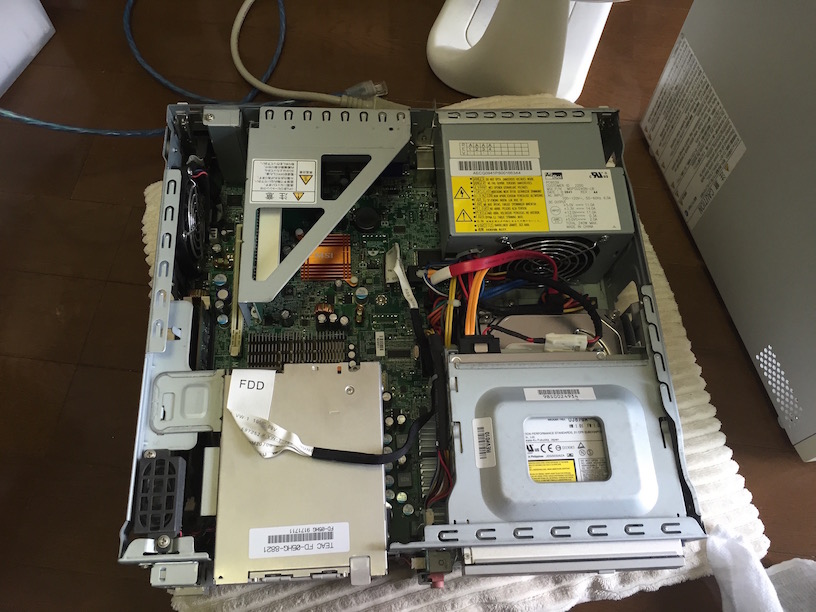
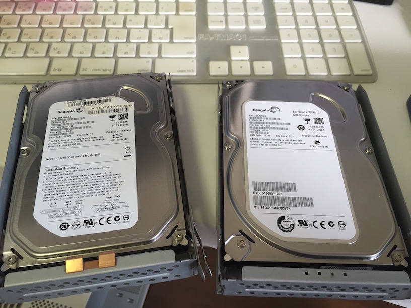
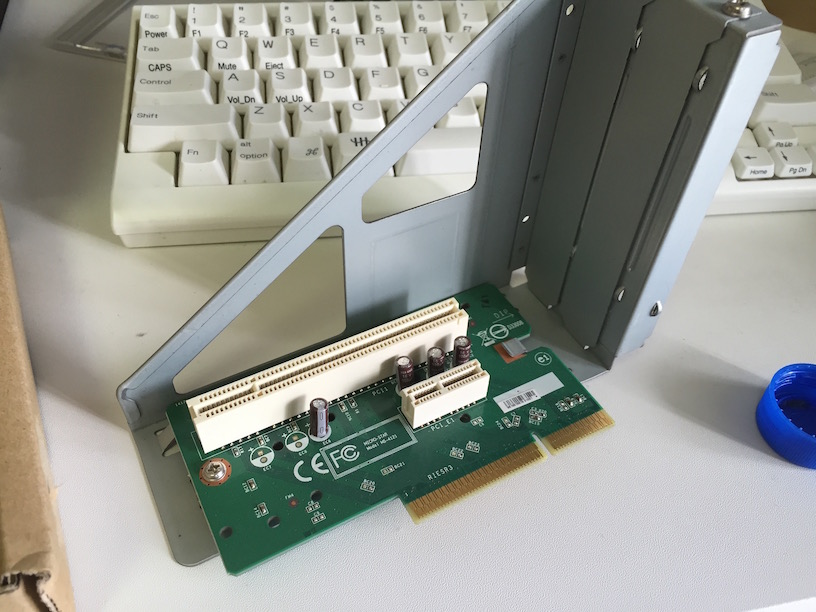
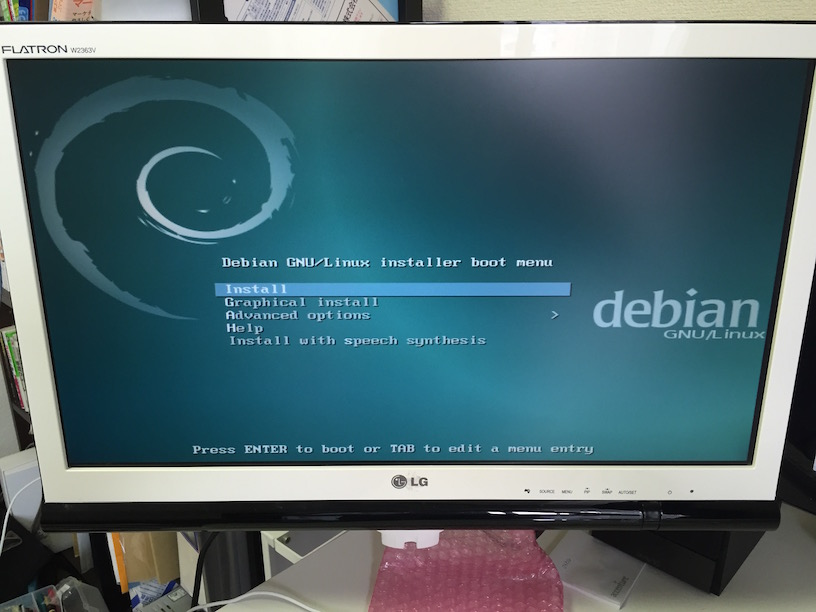

先週末に、以前からやりたいと言っていたchinachuで新しく録画サーバーを建てたのでその時のメモ。

## きっかけ

今まではPanasonicのブルーレイレコーダーで、別のディスプレイをひとつあてがって
アニメをひたすら録画したりBDに保存したりテレビ番組を視聴したりしていたが、
常に触っているパソコンから離れてBDレコーダに行くのが億劫に感じてきた。
ニコニコ動画配信アニメのアクセスの良さを実感。

PCの近くにBDレコーダを置いてもサブディスプレイをBDの方に切り替えなきゃいけないし、
別の場所に置いたら置いたで移動したり起動するのが面倒くさい。
キーボードやマウスの操作だけでサクッとアニメ視聴に移りたい。

ただ建てただけで今までのBDレコーダの上位互換になるかは疑問だが、
利便性やコストよりも自由を取るスタンスが勝ってしまった。

それに外部からのアクセスで録画番組をスマホから閲覧できると非常に便利。
家の中も皿洗いしながら録画番組を試聴したり、
出先で録画管理したり視聴したりするなど、夢も大きく広がる。

何より自分の力試しにもなる。
「21世紀なのにパソコンでテレビ番組が見られないのはおかしい」という信念もある。
最近仕事に時間を取られてアニメを視聴時間が減ってしまったので、
これを期にガッツリ立ててみることに。

## 今回使った材料

サーバーを新しく1台作りなおす段階から入ります。

### サーバマシン

以前から動いてはいたが電気代だけ食って特になんのバリューも発揮していなかった
Express5800 51Lf。今回これをフォーマットして新しいサーバーを立てる。

> Express5800/51Lf  
> http://support.express.nec.co.jp/usersguide/UC50/51Lf_a/51Lf_a.php

スペックは、RAM2GB、Intel Core 2 duo。
（あとから分かったがこのCPUではストリーミングにはやや力不足）

ハードウェア的なマニュアルは以下から。

> http://support.express.nec.co.jp/usersguide/UC50/51Lf_a/51Lf_a.php

### Debian 8.0 jessie amd64 インストールディスク

Debianの8.0 jessieがついこの前の4月あたりにリリースされたらしいので、
積極的に人柱になっていこうと思います。

ミラーは理研がオススメ。Disk1のみで基本的にOK。

> http://ftp.riken.jp/Linux/debian/debian-cd/8.0.0/amd64/iso-dvd/

インストールガイドは以下。

> https://www.debian.org/releases/stable/amd64/index.html.ja

### HDD

今回1TBのHDDを２つでRAID1にする。

> WD Blue 3.5inch 7,200rpm 1.0TB 64MBキャッシュ SATA3.0 WD10EZEX  
> http://www.amazon.co.jp/gp/product/B0085PZHXW

やや少なめだがPanasonic時代には500GBでそこそこ問題なかったし、
ある程度溜まってきたら母艦Macに移したりといくらでもできるからこんなもんでいいかなと。

### Chinachu

今回のメインの録画予約・管理ツール。Webインターフェースがモダン。
名前の由来は某百合漫画orアニメですかね。

> kanreisa/Chinachu
> https://github.com/kanreisa/Chinachu

Foltia ANIME LOCKERなどの似たソフトウェアもある中で、
Chinachuはオープンソースで無償、その代わり導入はLinuxわからないときつい。
通常のエンドユーザー向けではない。
自分はLinux大丈夫な人なのでお金がかからないChinachuに即決。

中身はNode.jsとTypeScriptらしいが、インストール手順がバッチリ整っていて
その辺りを意識することは全くない。

今年の夏辺りにChinachu Airというのもプレビューリリースされるらしい。
開発が活発なのも実は選定理由の一つ。

> Chinachu
> https://chinachu.moe

### PT3

録画サーバー界ではおなじみのPT3。
簡単に言うとアンテナ線とPCを接続する装置。
TVチューナーカード。
PCI Express 1があるロジックボードに対応。

地デジチューナーが２つ、BS/CSチューナーが２つ搭載されているから、
日常範囲では録画ブッキング等で困ることはないかと。
非常に評判のよいチューナーボード。

> PT3  
> http://www.amazon.co.jp/Earth-Software-PT3-Rev-A/dp/B00857CQAMa

## SCR3310-NTTCom

B-CASカードを読み取るための装置。
USBの外部接続だが評判がよかったのと事例が多かったから決定。

> NTTコミュニケーションズ 接触型ICカードリーダー・ライター e-Tax Win&Mac対応  
> http://www.amazon.co.jp/NTTコミュニケーションズ-接触型ICカードリーダー・ライター-e-Tax-Mac対応-SCR3310-NTTCom/dp/B00117VJ7O/

### B-CAS カード

PanasonicのBDレコーダーから抜き出した。

個別に手に入れる時ってどうするんだろ・・・？

## 作業の流れ

構築方法は既にいろんなブログで出ているので簡単に流れだけ。

マシンの中を開けるとこんな感じ。

まずはHDDの入れ替え。
ネジはきちんと巻いておかないと回り始めた時にガタガタ音がするのでしっかり止める。

PT3を装着する前のPCI Express端子。
一つネジを外してカバーを外し、PT3を指す。

BIOSでHDDをハードウェアRAIDにしようとするも、
インストール作業時にRAIDにならず別のHDDとして認識されてしまった。
どうやらハードエアRAIDというよりもオンボードのRAIDで貧弱な精度らしい。
もうちょっと確認が必要だけど、BIOSをいじらずおとなしくソフトウェアRAIDにすることに。

swap以外はext4ファイルシステム。ソフトウェアRAID。
スワップとboot以外は全部一つのディレクトリにした。

途中ブートローダーを入れずにインストールを終了してしまったため
いつまでも起動しないサーバーになってしまったのでやり直した。

OSを入れた後に、Chef Server管理にして個人的に秘伝のcookbookを適用してDebian jessieサーバーそのものは完成。
途中でこのcookbookがsudoやaptitudeが入っていることを考慮していなかった点あたりは修正した。

この後は以下の流れ。

* PT3のドライバインストール
  * https://github.com/m-tsudo/pt3
* SCR3310の読み込み
  * `aptitude install pcscd`
  * B-CASを認識するかテスト
  * サービスの自動起動
* chinachuインストール
  * GitHubのwikiを参照
* chinachu設定
  * 同じくGitHubのwikiを参照

chinachuのセットアップのこの流れは途中まで作業しながら大急ぎでcookbookにした。

> ikuwow/chinachu-cookbook  
> https://github.com/ikuwow/chinachu-cookbook

サーバーの立ち上げから行ったので総作業時間5時間ぐらい。

## 使用感

ストリーミングはSafariでは再生されない。ChromeやFirefoxならOK。許容。

録画した番組をMacにダウンロードして視聴するのは全く問題なく、非常に快適。
30分のアニメだと2GBぐらいあるが、ローカル転送なので1000BASE-Tの限界近くまで、
速度が出るから30秒ぐらいで落ちてくる。
.m2ts形式だからVLCで視聴。倍速再生も自由自在。

ただストリーミングは問題あり。
録画でも放送中番組でもビットレートを低くしないとカクカクする。
CPU使用率は100%前後。coreが２つだから最大200%まで行くはずだが使ってくれない。よくわからない。
他のブログ記事を参考にするとCore i7あたりを使っていたりするので、
Core 2 duoではややスペックが低かったと判断。

今後やることは２つ。

ストリーミングが行えないと利便性ロスが大きすぎるのでより高スペック（core i7以上？）のPCを自作する。

それとiPhoneやiPadで録画映像を見る方法を確立する。
ブラウザでchinachu-wuiにアクセスしたが再生できなかったので、
Ace Playerというやつが録画した生ファイルの.m2tsファイルを再生できたが、
番組のライセンスの問題で音声トラックが無効に・・・。
こちらも模索。

それにしてもChinachuさん素晴らしいです。今後の開発に期待。

## 参考記事

* [中古パソコンで作る格安な録画サーバ](http://yutorm.blogspot.jp/2014/09/used-pc-pt3-chinachu.html)
* [linuxで立てる録画サーバに必要なことまとめ（録画編）](http://karia.hatenablog.jp/entry/2014/10/28/044718)
* [録画サーバーChinachuをUbuntu 14.04で使う（１）](http://www.digital-den.jp/simplelife/?p=2769)
* [クリスマスに安心して一日中アニメを見るために録画鯖を作る技術](http://tolarian-academy.net/christmas-anime-2014/)
* [PT3を買ってセットアップ Part1(接続編)](http://ameblo.jp/akitoshi0406/entry-11973962076.html)
* [5万円でTV録画サーバを作る](http://5mande.blogspot.jp)
