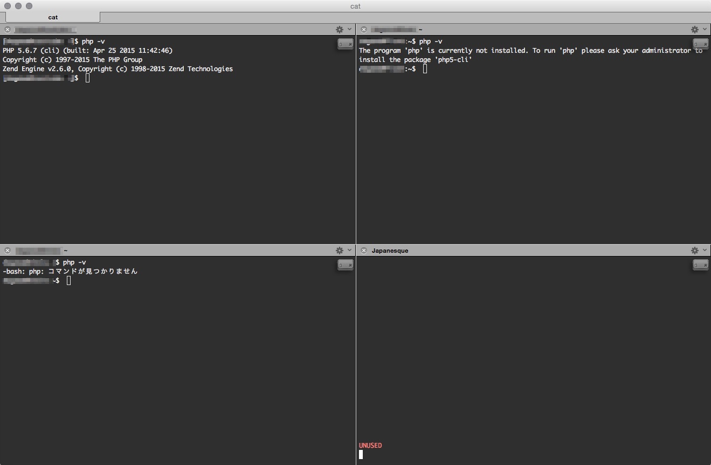

csshXというツールがある。
複数のホストに同時にSSHして、
それらの全てに同じキーボードの入力を送信できるツール。
要するに、リモートホストを一括で操作できるというスグレモノらしい。
サーバー6台とかを全く同じ手順で設定するときに非常に便利なのね。

ただこれをiTermで打つと、Mac純正の「ターミナル」が勝手に開く。
どうやらターミナルでしか扱えないみたい・・・。

自分はiTermの設定をバッチリ組んで最高の状態にしてあるのでどうしてもTerminalじゃなくて
iTermを使いたい。そんな中探していたのがi2cssh。

## i2csshXはiTermに対応した一括複数ホスト操作ツール

> wouterdebie/i2cssh  
> https://github.com/wouterdebie/i2cssh

インストールはgemで行う。

```
gem install i2cssh
```

一番簡単な使い方としては、`~/.ssh/config`に書いてある名称を複数打つのが簡単。

```:ssh-config
Host host1
   Hostname 111.111.111.111
   User someone
   Port 12345

Host host2
   Hostname 222.222.222.222
   User someone
   Port 12345

Host host3
   Hostname 333.333.333.333
   User someone
   Port 12345
```

```
i2cssh host1 host2 host3
```

そうするとiTermの別ウィンドウが立ち上がって、
それぞれにログインした上でスプリットされる。



ここで`cmd+shift+I`を叩くと、確認ダイアログの後に同じキーボード入力が
それぞれのホストへ送信されるようになる！
この一括操作モードだと各ペインの右上にアイコンが出るからわかりやすい。

個別に操作したくなったときは`cmd+shift+I`を打てば通常のiTermとして使える。

Cent OSサーバー4台に`yum update -y`したり
各サーバーのperlのバージョン調べたりするときにパパっと使うとすごく捗る。
何かと複数サーバーでの作業が多い人にオススメです。
