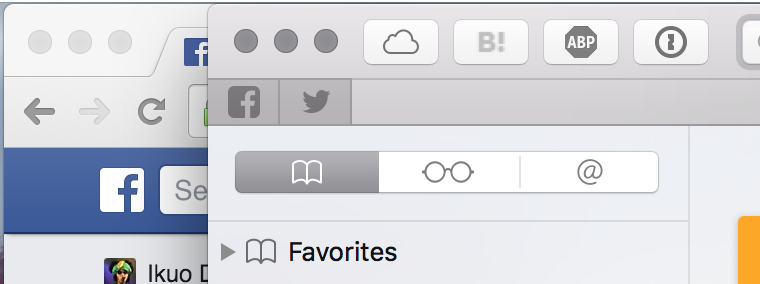
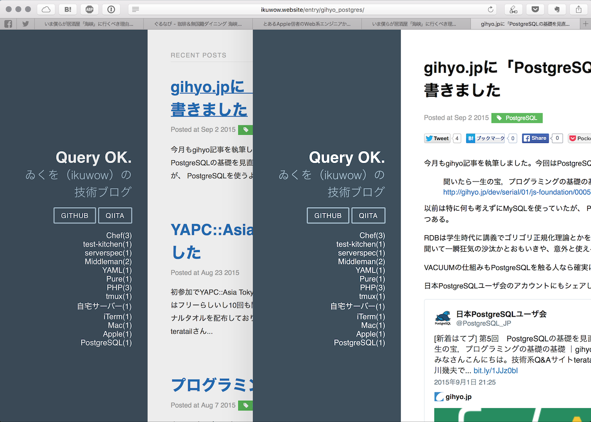

そこそこパソコンを触り慣れている人や開発者など少しリテラシーの高い人は、
Chromeをすぐインストールしてメインのブラウザとして使っていることが多い、というのが最近の風潮。
たまに「Chromeをインストールするためのアプリ」と揶揄され、IE化してきた感もやや否めない。

ただAppleの強みは硬い信念とそれに対する統一の意識なので、
Appleの世界では純正というだけで結構利点があるもの。
使い始めはそれだけで使いはじめ、すっかりハマった。
そんなもっぱらのSafari派である私が、
開発者から見たSafariの利点をChromeやFirefoxなどと比較して軽くまとめてみようと思います。

## デザインがシンプル

これは他のブラウザの追随を許さない利点。
ステータスバーやブックマークバーを隠せば本当にWebコンテンツを邪魔しないシンプルでミニマルなデザインになる。
ヘッダのサイズを比べてみると、ほぼおなじ機能が表示されている状態でSafariのほうが狭く、
画面を広く使ってブラウジングできる。

## メモリ使用量が少ない

以前に一度簡単に調べたところSafariのほうが少しだけメモリ使用量が少ないという結果が出た。
世間的にもSafariのほうがリソースを食わないというのが共通認識のようだ。

> 簡便なSafariとChromeのメモリ使用量の測定方法  
> http://qiita.com/ikuwow/items/976166b30610f33f4643

ただ本当に簡易な計測で、ちゃんと条件を揃えないといけないので有意差があるかどうかはちょっとまだわからない。
細かく検証する余地ががまだまだある。
少なくとも感覚的にはメモリ使用量は少なく感じる。

今後Chromeも省メモリになるという話もあるので、今後に期待です。

> Google Chrome v45では前回開いていたタブの復元順を改善し、Webサイトで使用するメモリ消費量を平均で10%削減。  
> http://applech2.com/archives/46161305.html

先ほど調べてわかったのですが、Safariはバッテリー消費量も一番少ないようです。

> Chrome対Safari対Firefox、最もバッテリー消費が激しいブラウザはどれ？  
> http://gigazine.net/news/20150731-power-consumption-browser/

## control+Pとcontrol+Nが使える

これは本当に地味な利点ですが、個人的にはとってもよい利点だと思っている。

Macは基本的にemacs的なショートカットが使用可能なので、
Safariはそれにならって同様のショートカットキーが使用可能。

ここで有用なのは以下の4つのショートカットキー。

* control+Nで下方向に少しスクロール
* control+Pで上方向に少しスクロール
* control+Eで下方向に1画面分スクロール
* control+Aで上方向に1画面分スクロール

他のショートカットキーと合わせればある程度ポインタのいらないブラウジングができます。

矢印キーはやはりちょっとvim使いとしては遠くて使いづらい。
VimiumというChrome上でvimも、ちょっとvimの真髄を発揮しようとすると違和感が拭えないので、
どうせならデフォルトでよいショートカットキーがあるSafariを使いたい。

> ^(ctrl)キーを駆使してホームポジションに引きこもる  
> http://qiita.com/ikuwow/items/8e19910955285d347dce

## 戻る・進む時に画面をすわっとして変更できる

ページ感の遷移がスムーズなのもAppleのこだわりで非常によい。

あと、ぼーっとブラウジングをしている時に「あれ、前のページなんだっけ」となったときにも便利。
「戻る」するほどじゃなくちょっと思い出したいだけなので、
SafariでトラックパッドかMagic Mouseでスワッと横にスワイプして指を止めていれば
直前に見たページをちら見できる、というわけです。
これも地味によいですね。

## iCloudでブックマークとタブを同期できる

これも大きな利点のひとつ。特にiOSデバイスやMacを複数台持っている人には特に重宝する。 MacでChromeを使っていても、iPhoneでChromeを使っている人が少ない印象なので、
一度MacのブラウザをSafariにするとこの良さを実感できるのではないでしょうか。
もちろブックマーク同期はChromeでもできますが、iPhoneでChromeを使わない人が多いのはなぜでしょう？

タブ同期も地味に便利。帰り道にiPhoneで見ていたページを
自宅に帰ってPCを復帰させてすぐブラウジングを続けられる。

## ChromeよりもSafariのほうが、拡大スワイプがスムーズ

トラックパッドを使ったスワイプ動作をした時、Safariのほうがぬるぬる拡大縮小できる。
さすがはAppleと言った感じ。Chromeだと単純に文字の拡大になってガクガク変化していく。

## 逆に欠点は？

ここまで利点を上げてきたがよく言われるように弱点も多い。

開発ツールがやや他のブラウザに比べて弱いのはやはり弱点。
El Capitanに搭載されるSafari 9では強化されるようだが
GMを少し触った限りではやはりまだChromeやFirefoxに比べて力不足。
特にHAR(HTTP ARchive)を見られないのが辛い。
サイトのパフォーマンスやリクエスト数を簡易に計測して可視化するのができないと、結構こまめにパフォーマンス気にする人には辛いかも。
私はパフォーマンスを見るときはわざわざFirefoxを呼び出してます。

タブにfaviconが出ないのも地味に視認性が悪い。Safari Standを使って表示ができるので、ひとまず自分の中では解決している。

Chromeのタブを固定する機能は便利でSafariにそれがないのを残念に思っていたが、
Safari 9からはその機能が搭載される。
GMで使ってみたところかなり便利。
GmailやGoogle Calendar、GitLab等は常に出しておきたいタブなので、コンパクトに収まってしかもfaviconでその存在がわかりやすいのはよい。

ChromeやFirefoxは拡張機能エコノミーが非常に盛んなのがよいところ。
Safariで同じ機能拡張を探してもない、ということがよくある。

## おわりに

仕事でもプライベートでも普段使いで使い、
MacやiOSデバイスを多く持つほどSafariの良さが生きてくる感じですかね。

開発ツールとしては、
SafariよりもChromeやFirefoxのほうが、開発ツールが充実しているのは確かなので、
「開発用ブラウザ」のような位置づけにはしづらいかも。
単純に開発目的で比較すると他のブラウザの方が利点は多い。

ただSafariの開発ツールでも基本的なことは問題なくできるので、たまに発生する特定の機能を使いたい瞬間だけそのブラウザを立ち上げるでもよいのかもしれない。

スペックの低めなMacを使っている場合は、リソースを食わないSafariが候補に上がるということがありそう。

「Safariこういうところもいいよ」とか「Chromeだってそれできるよ」などの意見は大歓迎ですので、ぜひ教えて下さい。

Happy Browsing!
