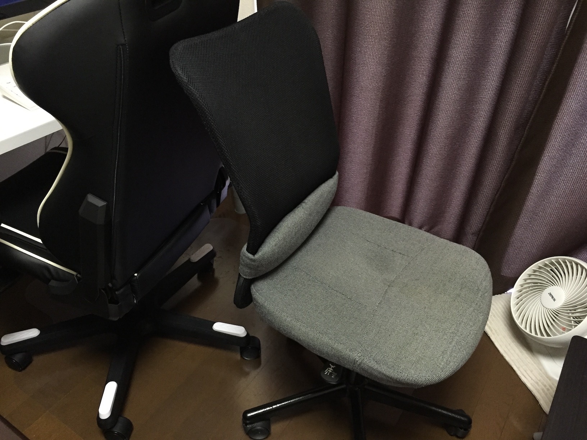
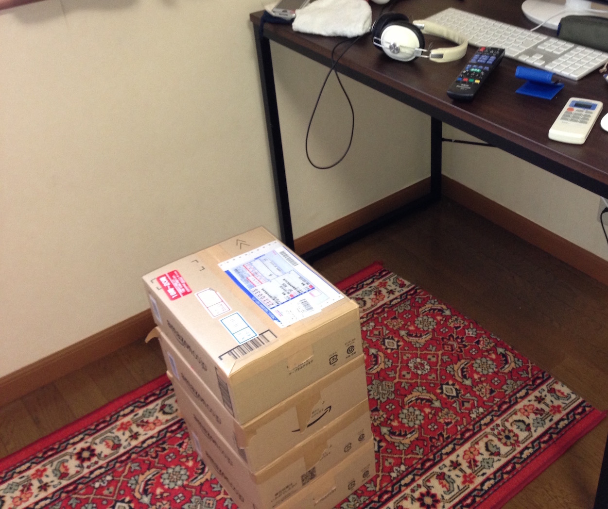

ゴールデンウィークということで、より長時間自宅で過ごせるように
椅子を新調しました。

ゲーミングチェアとかレーシングチェアとかいうやつです。
メーカーは安心のDXRacerを選びました。

<blockquote class="instagram-media" data-instgrm-captioned data-instgrm-version="6" style=" background:#FFF; border:0; border-radius:3px; box-shadow:0 0 1px 0 rgba(0,0,0,0.5),0 1px 10px 0 rgba(0,0,0,0.15); margin: 1px; max-width:658px; padding:0; width:99.375%; width:-webkit-calc(100% - 2px); width:calc(100% - 2px);">
 
 

 
 <a href="https://www.instagram.com/p/BExM4yhiDH6/" style=" color:#000; font-family:Arial,sans-serif; font-size:14px; font-style:normal; font-weight:normal; line-height:17px; text-decoration:none; word-wrap:break-word;" target="_blank">レーシングチェアを買ったらデスク周りが最強になりました座り心地はハーマンミラーなんかよりもずっといい。</a>
 
A photo posted by Ikuo Degawa (@ikuwow) on <time style=" font-family:Arial,sans-serif; font-size:14px; line-height:17px;" datetime="2016-04-29T03:17:13+00:00">Apr 28, 2016 at 8:17pm PDT</time>

</blockquote> 

いま3日ほど使ってみたが本当に快適。
ここ数年で最高のライフハックになった気がする。

## 今までの椅子はこんなの

ささやかな奨学金の貯蓄だけで突発的に一人暮らしを始めたために
人生でもっともお金がなかった修士1年の春ごろに
確かAmazonで2000円ぐらいで買ったやつ。

これを買う前までは**ダンボールに本を詰めて重ねて座っていたというほどには貧乏**だったので、
このころはこれだけでも満足していました。

とりあえず買ったやつなので全然快適でもなんでもなく、
慣れたからいいものの座り心地はよくなくて、いづらさをずっと感じていた。

## ゲーミングチェアは何がいいの？

まず**腰への負担が圧倒的に少なくなった。**

今までの椅子もそうだけど、
デスクチェアというやつはだいたいが前傾姿勢で作業するのに向いている椅子なんですね。

会社で使っているハーマンミラーの椅子は、
垂直よりも座面を地面と水平よりも前に傾けた状態で固定できたりと、
完全に前傾姿勢用。

> セイルチェア - オフィスチェア - ハーマンミラー  
> http://www.hermanmiller.co.jp/products/seating/performance-work-chairs/sayl-chairs.html

これはこれで座り心地はよいんだけど、
背もたれにもたれかかってリラックスするにはとても不向き。

このゲーミングチェアは
後傾姿勢でもたれかかって体の力を抜けて、
いわゆる「社長イス」に近い座り心地。

プログラミングやゲームなど、
後傾姿勢でリラックスして長時間作業したい時には絶対にこっちのほうがいいですね。

腰が楽になったので**姿勢を変える頻度がずっと少なくなった。**
強引に後ろにもたれかかって腰に負担をかけたりしてたのでガタガタ姿勢を変えていたけど、
それがなくなったので集中も続く。

あと**家にいても飽きなくなった。**
ずっと座っていても大丈夫で安定感あるし、眠くなったら160度リクライニングして昼寝もできるしで、
自宅最高！ッて感じが増した。

## いいね

組み立ても全然難しくないし、
体が大きい人には、縦に長いタイプとか横に長いタイプとかもあるみたいです。

メーカーはDXRacerの他にもAKRacingが有名。
実はサンワサプライなんかも似たやつ出しているみたい。

ただ基本的にでかめ椅子なので、僕は足がつかないんですね。
足ぶらぶらさせてると膝に負担が来るので、
Amazonでフットレストを注文しておいた。

自宅最高感すごい。
