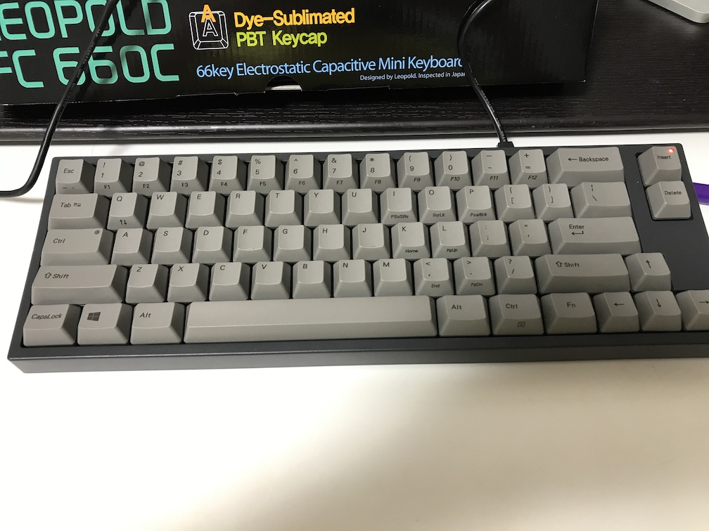
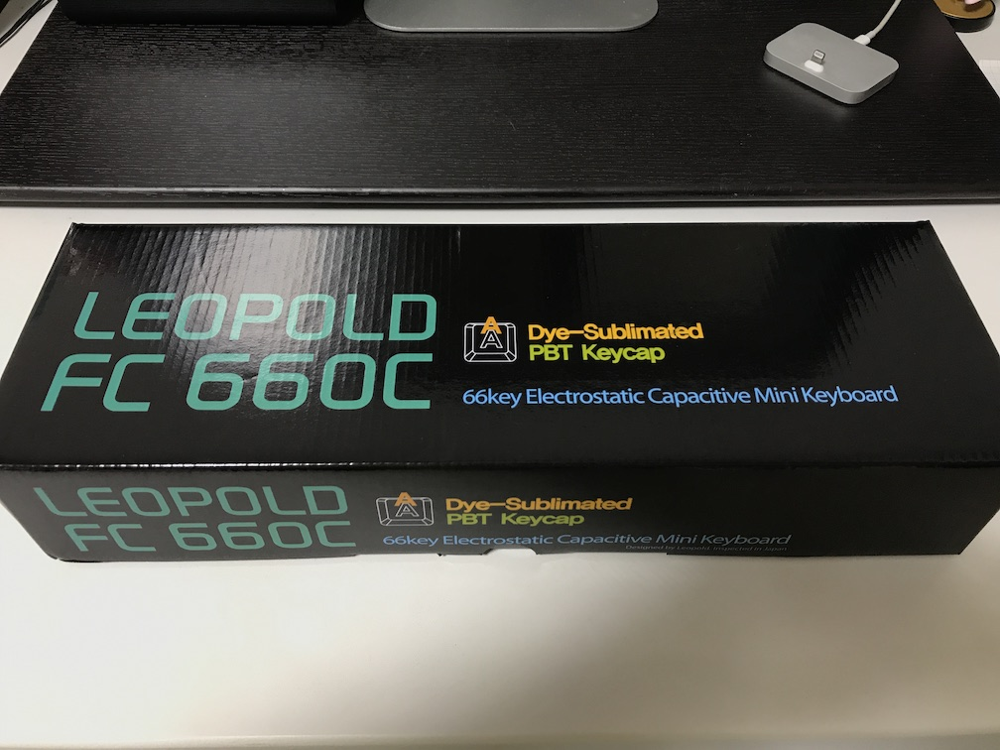
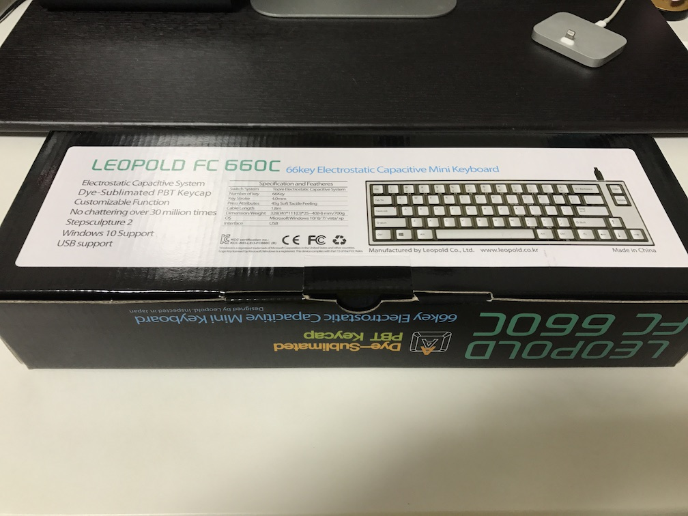
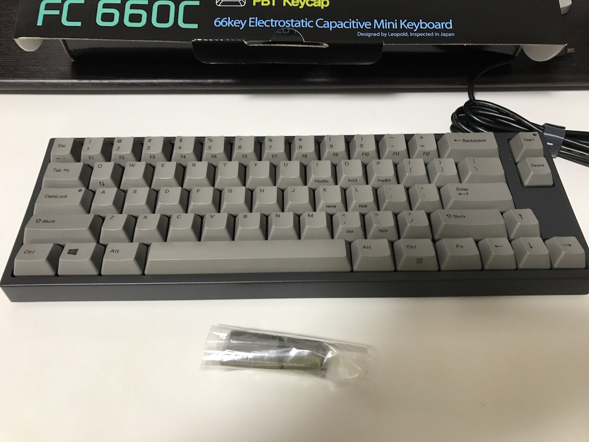
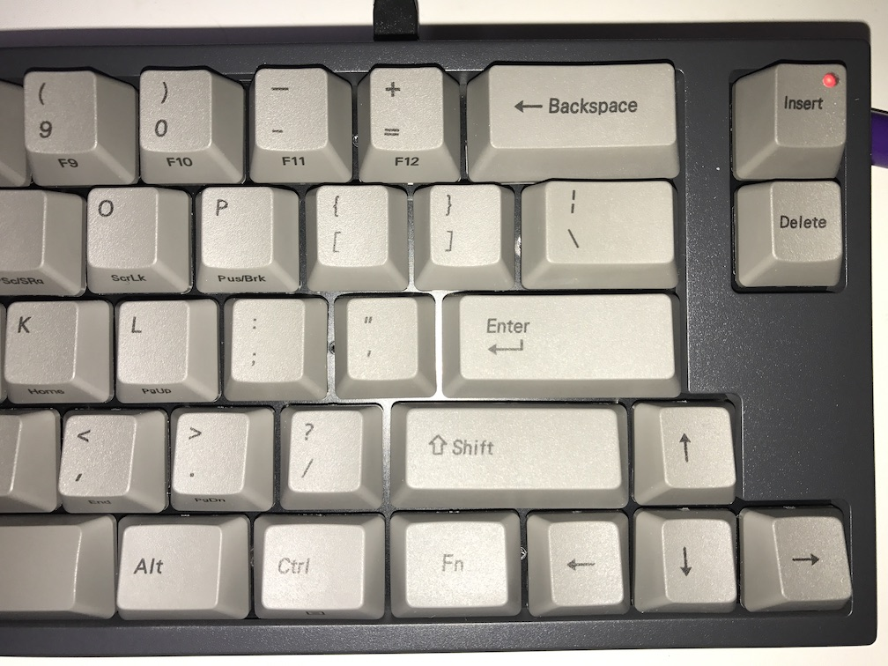
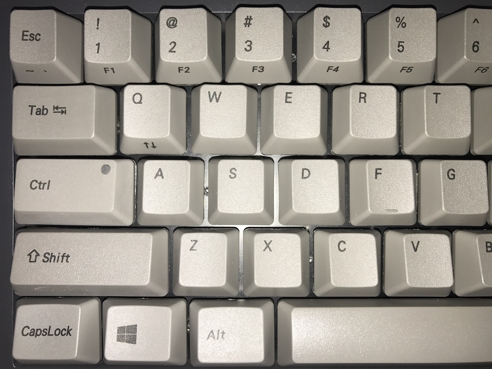
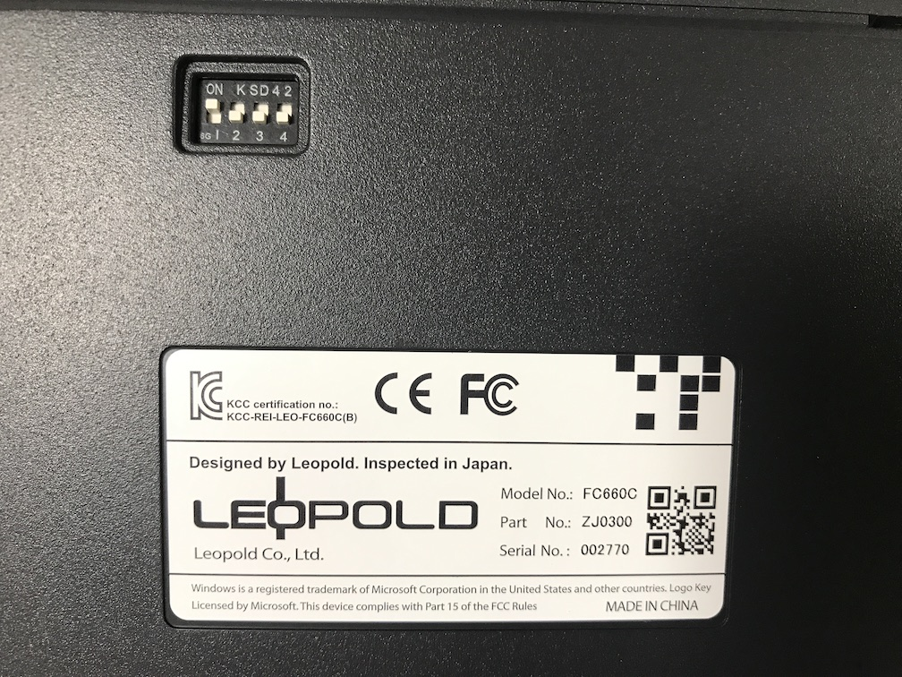
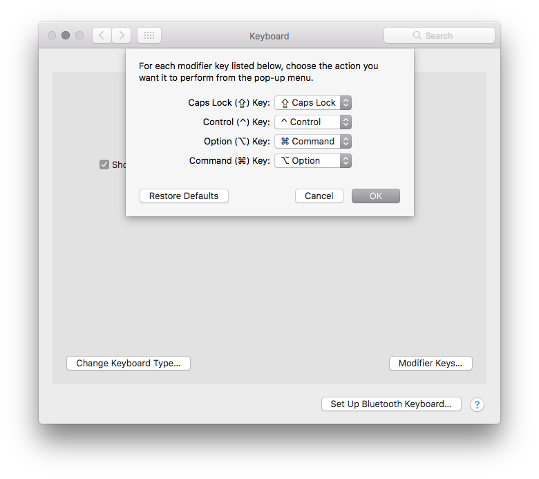
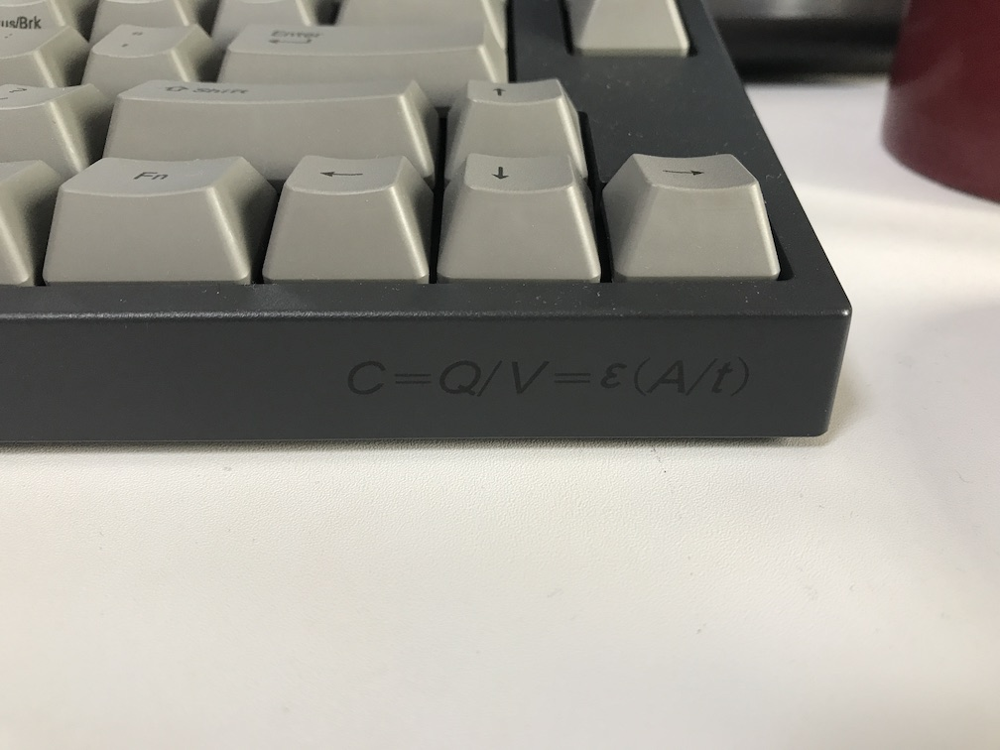

新しく買ってみたキーボードLEOPOLD FC660Cが非常に良かった。
日本代理店の[アーキサイト](http://www.archisite.co.jp/products/leopold_keyboard/fc660c/)の
サイトに商品情報が乗っている。
というかこのキーボードを知っている人はすごく少ないんじゃないだろうか？

価格は2万円ちょい。
価格.comの最安値で購入したらAmazonよりも5000円ぐらい安かった。

---

これぐらいの価格帯で静電容量無接点スイッチのキーボードでは
Happy Hacking Keyboard Professional 2(以下HHKB Pro2）が有名で、
オフィスで使っていたが問題を感じていた。

<a href="http://www.amazon.co.jp/exec/obidos/ASIN/B000EXZ0VC/ikuwow-22/" rel="nofollow" target="_blank">PFU Happy Hacking Keyboard Professional2 墨 英語配列 静電容量無接点 USBキーボード Nキーロールオーバー UNIX配列 WINDOWS/MAC両対応 ブラック PD-KB400B</a>

PFU

1つは、矢印キーがない。
基本的にFnキーを押しながら使うキーの扱い。

コード書く際には全く困らないが、 MacのMission ControlのショートカットControl + 矢印キーで
ウインドウを切り替えるときに押すキーが多くて面倒だった。

もう1つは、`\` `|`キーと、`` ` `` `~`キーの位置。
`\` `|`キーはBackspaceとの兼ね合いで場所が変更されていて、Macのデフォルトのキーボードと異なる。
`` ` `` `~` は特に違いが大きくて、右小指で押す位置に移動していて、ESCが代わりに陣取っている。

当然変更したらいい（無刻印だしキーの取替もしなくていい）というのはあるが、デフォルトを尊重する信念に反する。HHKBの意思にも反する。

---

そこで見つけたのがこのLEOPOLD FC660C。

<a href="http://www.amazon.co.jp/exec/obidos/ASIN/B00PINUFDQ/ikuwow-22/" rel="nofollow" target="_blank">LEOPOLD 静電容量無接点スイッチ採用コンパクトキーボード 英語ASCII配列66キー ブラック FC660C/EG</a>

LEOPOLD

キーボードの選ぶ条件にしていたのが以下の通り。
一応このFC660Cは全て満たしていた。

* 英語配列
* 静電容量無接点スイッチ
* テンキーなし（横幅狭くてコンパクト）
* Macで使いやすい（あまり設定を変えすぎないように）
* 上に上げたHHKB Pro2の問題を解決するもの

パッケージ

同梱物。
とはいっても接続用のケーブルとCtrl, CapsLockの交換用キートップだけ。

キーの右側。
基本的にMacの配列とほぼ同じなのが嬉しい。
InsertとDeleteキーが別にある。Fnキーは右にある。

キーの左側。
ControlとCapsLockはキートップを変更した状態の写真。

打鍵感としてはHHKBに非常に似ている。ややカチャカチャはするが非常に心地よく全く問題ない。
どこかのサイトでみた評判通り。
あと本体が非常に重くどっしりしている。安定感は抜群。

色は黒と白の二種類あるが、白は色分けが微妙で、黒が真っ黒ではなくグレーなのがよかったので黒にした。
キー以外の土台の部分はサイトの写真だと青く見えるが全然青には見えないグレー。

## やった設定

基本的にキー配列はWindowsのものなので、変更する必要はあるが、必要最低限で済む。
キーボード裏のスイッチでCapsLockとCtrlを、
MacのModifier Keysで⌘コマンドと⌥オプション（Alt）を、それぞれ交換したら充分。

1番をonにするとCapsLockとCtrlが切り替わる。キートップもそれぞれ換えが用意されている。

Modifier Keysで行う変更に関しては自分の中ではセーフ。

日本語英語の切り替えは引き続き[⌘英かな](https://ei-kana.appspot.com)

また`` ` `` `~`はESCキーと同じ位置にあって、Fn+QでESCと切り替えられるかたち。
コードを書く際は常に前者にしているが、何か現れてキャンセルしたいときはキーボードの左上をとりあえず押しておくという癖が抜けずにすこし間違う。

---

かなりデフォルトの配列に近くて、MacBook Proに写って作業を始めるときもタイプミスが少なくて非常に良い。
HHKBの打鍵感が好きな人にはかなりオススメしたい。

なぜか右手元についている静電容量の式。
