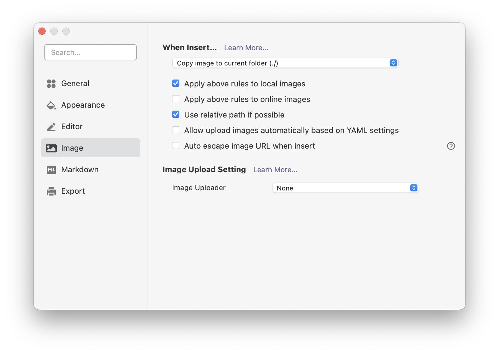

Middleman Blogの今の設定だと、全画像を共通の1つの階層に入れて管理しており、記事の.mdファイルと同じ階層に置きつつ.mdも同じ階層にしたいのでそうした。ついでにTyporaでスムーズに記事を挿入するための設定もメモ。

## やりたいこと

以前までのこれを、

```
source
└posts
  └2021-01-01-title.html.md
└img
  └2021-01-01-someimage.png
```

日付部分で記事との対応を取っていて冗長。.mdで画像のパスを指定するのも面倒なのでこうした

```
source
└posts
  └2021-01-01-title
    └index.html.md
    └someimage.png
```


## Middlemanの設定

結局config.rbをこうするだけでできた。もちろんURLは変わらず。

```diff
activate :blog do |blog|
[...]
-   blog.sources = 'posts/{year}-{month}-{day}-{title}.html'
+   blog.sources = 'posts/{year}-{month}-{day}-{title}/index.html'
[...]
end
```

PR https://github.com/ikuwow/query_ok/pull/231

参考 https://webfood.info/middleman-blog-how-to-manage-images-with-article/


```bash
$ bundle exec middleman article foobar
      create  source/posts/2021-04-08-foobar/index.html.md
```

画像は例えば `source/posts/2021-04-08-foobar/someimage.png`をこんな風にそのまま相対パスで参照できる。

```index.html.md

```

ただし `middleman build` した後の画像の階層には `blog.permalink = 'entry/{title}.html'` のような設定は反映されず、
`/posts/2021-04-08-foobar/image.png` となる。
これはやや気持ち悪いが妥協した。

## Typoraで記事を書きつつ画像を追加

Middlemanでここまでの設定ができると、[Typora](https://typora.io)で記事を書きながらクリップボードの画像をcmd+Vで貼り付けることが出来るようになる。

Typoraで画像の `Copy images to current folder` を設定する。



あとは適当に画像をペーストしたら自動的に同じ階層にファイルが作られて便利。
静的ページ生成ツールでもTyporaでMarkdownが書けるようになり、とても便利になった。
