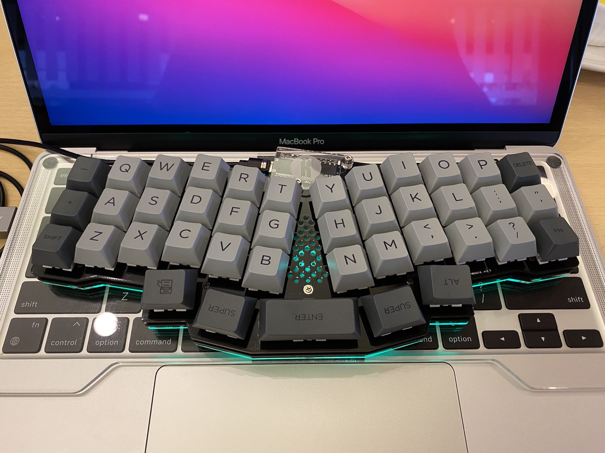
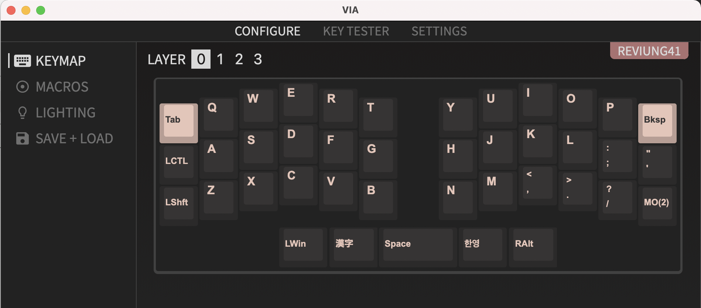
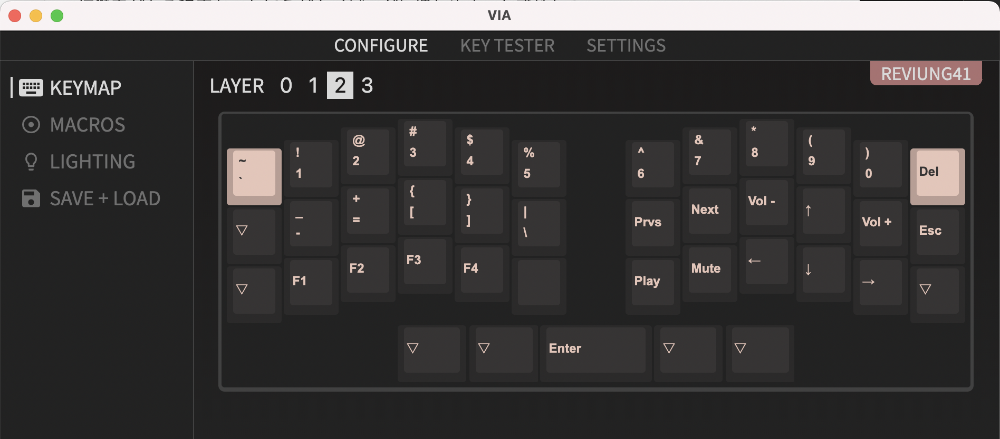

作りました。

カフェやファミレスでMacBook Pro作業するときに、ビルトインのキーボードで長時間作業すると肩凝りがすごいが、分割キーボードを使おうと7sProを引っ張り出すのもセットアップと片付けが億劫、と思っていたところにREVIUNG41を発見。

https://twitter.com/yushakobo/status/1397410161657106434

コンパクトな40%キーボードで一体型、column-staggeredで手や腕のコリが起きづらそう。ほぼ一目惚れ。
40%キーボードは、あって当たり前だと思っていたキーのない分慣れが必要なので避けていたが、今持っている要求にぴったりだったので覚悟をして購入。人気なのか今は遊舎工房だと売り切れになっている。積むことを恐れずに買っておいて良かった。

キースイッチはCherry MX赤軸。
持ち運びするつもりなので静音赤軸が良いと思ったが、
とりあえず遊んでいた赤軸で作ってみて打鍵感の良さに感動したのと、
ある程度打鍵音のあるほうがタイピングに慣れやすいと感じたので、
しばらくはこの静音でない普通の赤軸のまま。
慣れたら7sProの静音赤軸スイッチと交換しようかしら。

キーキャップは [PBT Gray Dye sub Keycaps](https://shop.yushakobo.jp/products/pbt-gray-dye-sub-keycaps?variant=37665504690337)。Cherry Profile。
秋葉原の遊舎工房店舗へ行ったときにシンプルでクセがなくかつお手頃なお値段だったので買った。
まだキーキャップ沼にはそこまでハマってないので十分満足。

キーマップはこんな感じ。

レイヤーは二つにまとめた。
当然だがキーの数が少ないので、`1234567890-=[]\esc` のような、頻度はそこまで高くないぐらいのキーを叩くのが大変になる。Enterをスペースバーでやるのは逆に使う頻度が高すぎて慣れた。

MacのJISキーボードのように英キーとかなキーを追加した。
左の「漢字」キーは `KC_HANJ` かつ `KC_LANG2` 、右の読めないハングルは `KC_HAEN` かつ `KC_LANG1` 。
もともとWindowsでいう「変換 `KC_HENK`」「無変換 `KC_MHEN`」をこの位置に設定していたが、
iPadと接続時に入力方式の変換が動かなかったので前者にした。
iPadで使う予定はなかったが意外に快適だったからたまに使ってみようと思う。

今はこの記事のトップの画像みたいに、バード電子のキーボードブリッジを使ってMacBook Proの上に置いて使っている。
汚れが目立つだろうと思い白は避けてクリアにしたが、裏のゴムやキーボードが見えてちょっと気になるので白の方がよかったかも知れない。

半田付けの数は多めか。LEDの半田付けスペースが小さいのでなかなか大変だった。
4つめを付けたら2コ目以降が付かなくなったり、接触が悪くてUSBケーブル刺すたびに特定のLEDが付かなくなったり、特定の明るさになるとチカチカしだしたり。
テスターでGND同士/VOD同士がちゃんとショートしてるか確認したりして原因究明できたが、よくわからなかったものはとりあえず半田付けし直して解消させた。
完成してからもう3回ぐらい分解し直してはんだ付けしなおしているからさすがにもう大丈夫かな。
LEDは熱に弱いということでビビってあまり半田ごてを当てないようにしていたが、意外と大丈夫だった。

40%キーボードだがcolum-staggeredなので意外とコンパクトというほどでもない。60%でstaggeredだったらMacBook Pro 13inchの上に載らなかったかも知れない。タイピングはだんだん慣れてきたたところ。

さてしばらくはMacBookのお供としてこのREVIUNG41を常にリュックに携えて生活しようと思います。毎日楽しく叩いています。

## 完成までのTweet

https://twitter.com/ikuwow/status/1402440884713451523

https://twitter.com/ikuwow/status/1402483094725087239

https://twitter.com/ikuwow/status/1402498646172569600

https://twitter.com/ikuwow/status/1402797527447969793

https://twitter.com/ikuwow/status/1402884156107804676

https://twitter.com/ikuwow/status/1403003558849515522

https://twitter.com/ikuwow/status/1403251672923578370
